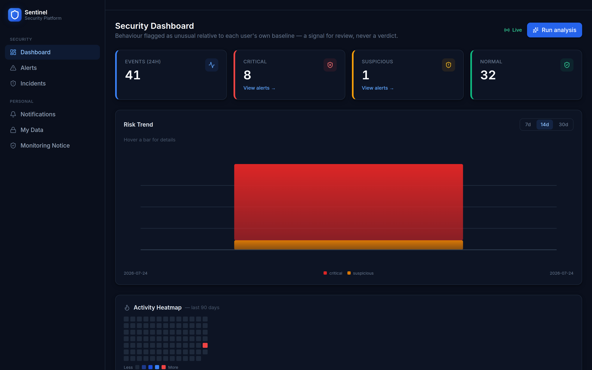
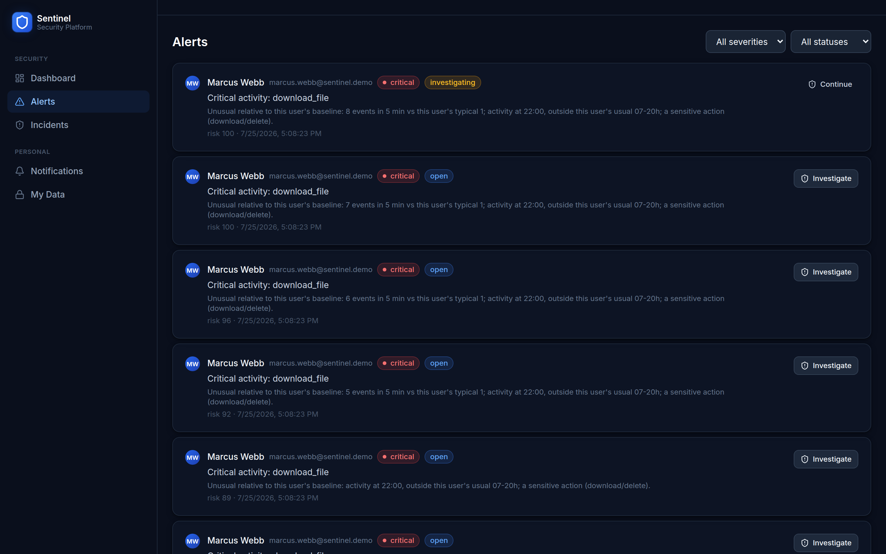
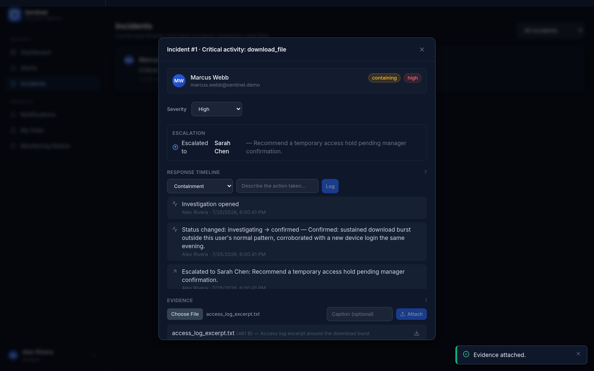
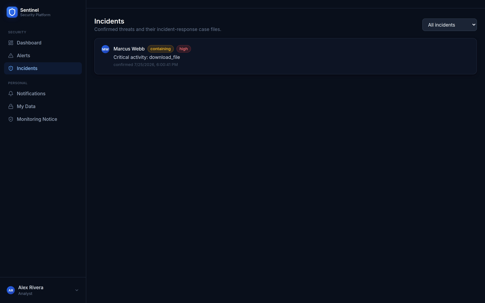
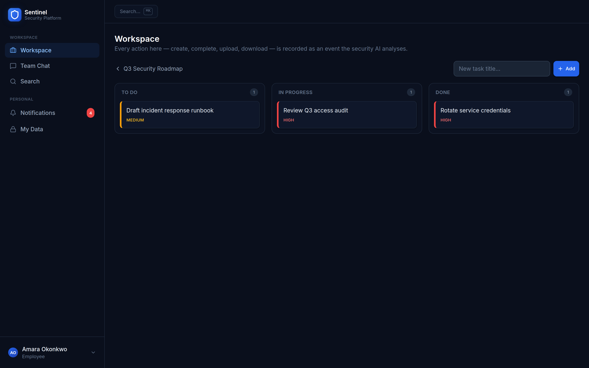
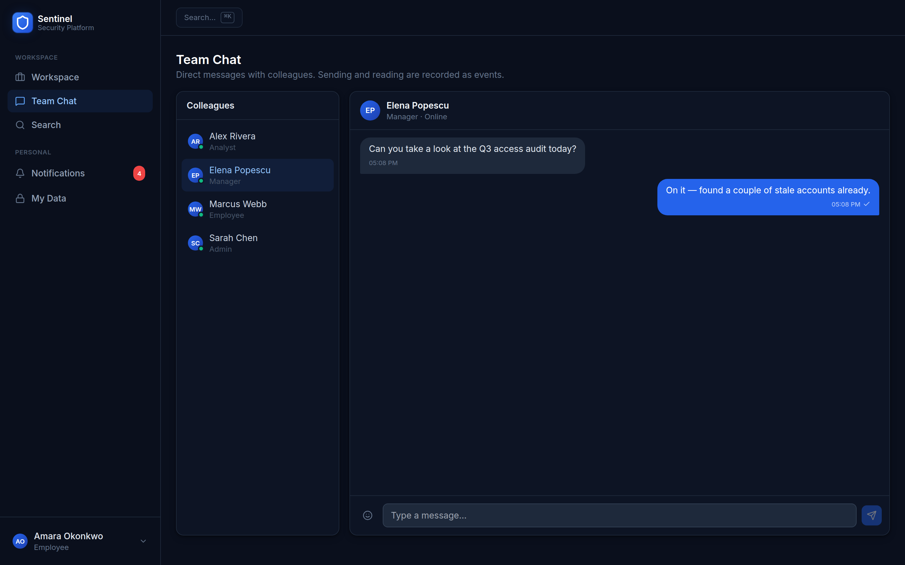
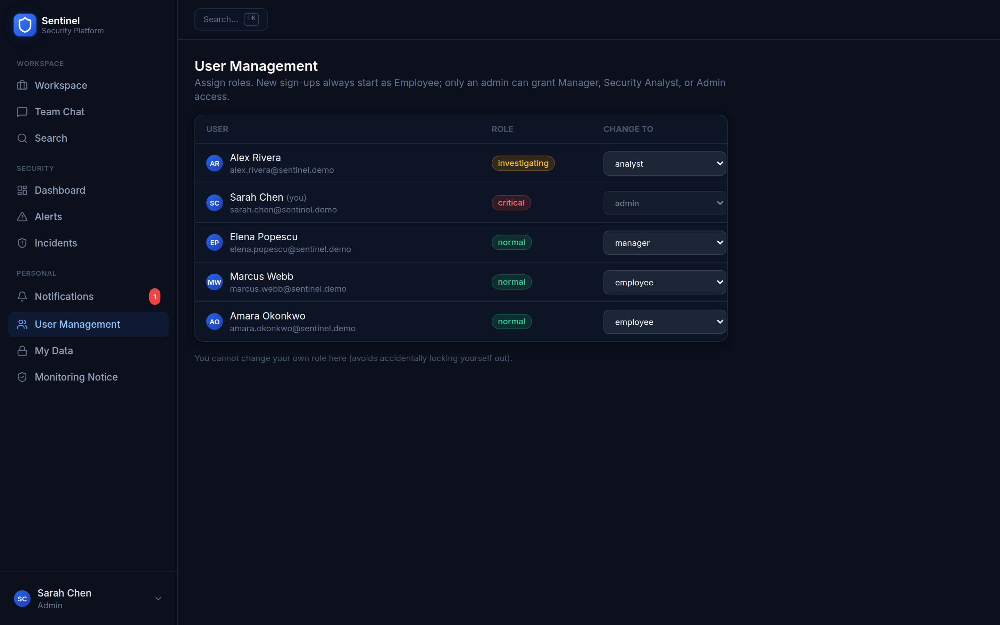
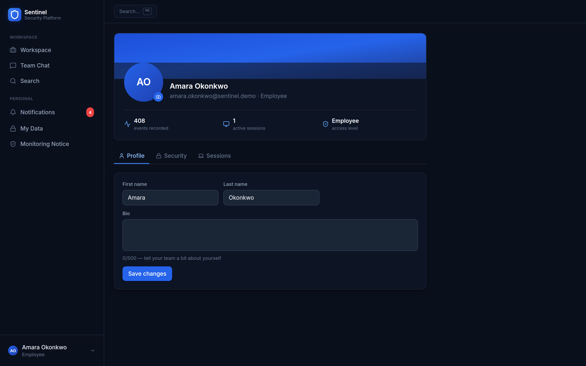
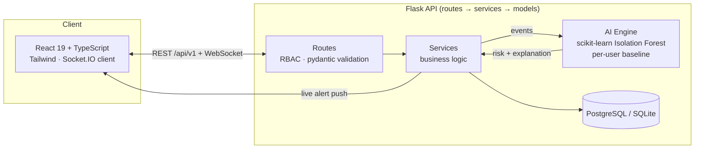
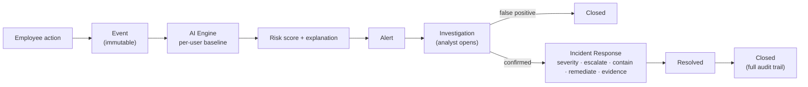

# Sentinel Platform


An AI-powered **User Behavior Analytics (UBA) and insider-threat detection**
platform. Employees do real work in a collaborative workspace; every
meaningful action becomes an immutable **Event**; the **AI Engine** scores
each event against that *specific user's own* historical baseline; a security
analyst reviews the resulting alerts and drives a full **incident-response
workflow** — from first look to a documented, resolved, archived case.

> **The AI never decides. It flags what's unusual for a person, explains why,**
> **and a human analyst takes it from there — every time, no exceptions.**

```
Employee action → Event → AI Engine (per-user baseline) → Risk + Explanation
                                → Alert → Investigation → Analyst verdict
                                            → Confirmed → Incident Response
                                              (severity · escalation · containment
                                               · remediation · evidence · resolution)
                                            → Closed, full audit trail
```

---

## Screenshots

| | |
|---|---|
|  **Security Dashboard** — live stats, risk trend, 90-day activity heatmap |  **Alerts** — every flag comes with a plain-language explanation of *why* |
|  **Incident Response** — severity, escalation, response timeline, evidence, all on one audit trail |  **Incidents** — the SOC case-management view, separate from the raw alert inbox |
|  **Workspace** — a real Kanban board; every action here is behavioral signal for the AI |  **Team Chat** — direct messages, read receipts, presence |
|  **User Management** — least-privilege role assignment |  **My Account** — profile, security, sessions |

More: [login](docs/screenshots/01-login.png) · [notifications](docs/screenshots/11-notifications.png) · [workspace projects](docs/screenshots/07-workspace-projects.png)

A shot-by-shot walkthrough script (for recording your own demo video) is in
[`docs/DEMO_SCRIPT.md`](docs/DEMO_SCRIPT.md).

---

## What makes this different from a CRUD app with charts

- **The AI is the product, not a decoration.** Every feature the model sees is
  a deterministic SQL aggregate over the immutable `events` table — no
  synthetic or random values, anywhere. A user is only ever compared to
  **their own** history: an Isolation Forest trained **per user**, risk scored
  as a robust z-score against that user's own anomaly-score distribution. A
  night-owl's normal 2am activity is normal *for them*; the same login for
  someone who's never worked past 6pm is flagged — because it's unusual for
  *that specific person*, not because of a hardcoded "business hours" rule.
- **Every score is explainable and permanent.** Risk score, confidence,
  feature vector, human-readable explanation, and model version are persisted
  the moment a score is produced (`AIAnalysis`) — an analyst can always ask
  "why was this flagged?" and get the *original* answer, never a regenerated
  guess.
- **Users under ~50 events return `insufficient_data`, not "normal."** The
  Dashboard's baseline-coverage view makes that explicit — "not enough history
  yet" and "behaving normally" are never conflated.
- **The AI never acts.** It raises an Alert. A human analyst opens an
  Investigation and reaches a verdict. Confirming a real threat doesn't close
  the case — it opens a full incident-response phase on the same record:
  severity, escalation to an administrator, containment/remediation actions,
  evidence upload, and a resolution summary required before the case can be
  archived. Every step lands on one append-only audit trail.

---

## Feature tour

**AI Engine**
Per-user Isolation Forest baseline · deterministic feature extraction (time-of-day,
velocity, distinct-action burst, new IP/device, off-baseline-hours) · confidence +
persisted explanation per score · analyst feedback loop (confirmed vs. false-positive,
tracked per model version) · risk-trend chart · baseline-coverage transparency panel.

**Alerts → Investigation → Incident Response**
Idempotent investigation workflow (open → confirmed → containing → resolved →
closed) · analyst-assigned severity, distinct from the AI's own severity ·
escalation to an administrator with notification · containment/remediation
action log · real file evidence upload/download · resolution summary required
before archiving a confirmed case · dedicated Incidents case-management view.

**Workspace**
Projects, Kanban tasks, notes, and real file upload/download — every mutation
emits exactly one behavioral Event, because that's what the AI actually learns
from. Full-text search across all of it, plus a Cmd+K command palette.

**Team Chat**
Direct messages, read receipts, presence, real avatars.

**Identity & access**
JWT auth with refresh, session/device management (list & revoke), RBAC across
four roles (Employee/Manager, Security Analyst, Admin) enforced at the route
layer, account profile with avatar upload and password change.

**Privacy & compliance**
A written monitoring notice, subject-access export of one's own event history,
data-retention purge tooling, and analyst-action auditing — see
[`docs/15`](<docs/15 - Human Review and Compliance.md>).

**Engineering**
71 backend tests (pytest) + 17 frontend tests (Jest/RTL), GitHub Actions CI
(typecheck, lint, test, build on every push/PR), Alembic migrations for every
schema change, Docker + docker-compose for a production-like run.

---

## Architecture





Backend layering (docs [`13`](<docs/13 - Flask Extensions Architecture.md>),
[`14`](<docs/14 - Backend Project Structure Final.md>)): **routes (thin) →
services (business logic) → models ← extensions**. Cross-cutting: RBAC
decorators, pydantic request validation, centralized error handling,
pagination, real-time WebSocket alerts.

| Component | Stack |
|-----------|-------|
| **Backend API** | Flask 3, SQLAlchemy, Flask-Migrate (Alembic), Flask-SocketIO, JWT (PyJWT), bcrypt, pydantic, flask-limiter |
| **AI Engine** | scikit-learn (Isolation Forest), per-user baseline features |
| **Frontend** | React 19 + TypeScript, Tailwind CSS, React Router, Socket.IO client |
| **Database** | PostgreSQL (prod) · SQLite (dev) |
| **Deploy** | Docker + docker-compose, gunicorn + gevent-websocket |
| **CI** | GitHub Actions — pytest+coverage, pyflakes, tsc, Jest, production build |

---

## Getting started (development)

```bash
# Backend
cd backend
python -m venv venv && source venv/bin/activate
pip install -r requirements.txt
cp .env.example .env                 # fill in local values
export FLASK_APP=run.py
flask db upgrade                     # provision the full schema (migration-driven)
python run.py                        # http://localhost:5000

# Optional: generate deterministic dev history so the AI has something to score
python scripts/dev_behavior_generator.py --seed 42 --scenario bulk_download

# Frontend (new terminal)
cd frontend
npm install
npm start                            # http://localhost:3000
```

`flask seed-admin` (run from `entrypoint.sh` on every startup, right after
`flask db upgrade`) ensures a bootstrap **Admin** account exists — idempotent
by checking whether `DEFAULT_ADMIN_EMAIL` already exists as a user, not by
migration state, so it correctly reacts if you change these and redeploy
(a one-shot Alembic migration can't: see `app/services/bootstrap_service.py`
for why this isn't one). Default `admin@sentinel.local` / `ChangeMe123!` in
development; **in production it requires `DEFAULT_ADMIN_EMAIL` and
`DEFAULT_ADMIN_PASSWORD` to be set** whenever that account doesn't exist yet
(fails startup otherwise, rather than silently create an admin with a
guessable password). Log in with that account, then promote any
self-registered account (`/signup` always creates **Employee**) to
Manager/Analyst/Admin from the User Management page.

### Tests

```bash
# Backend — 71 tests, isolated throwaway SQLite per test run
cd backend && pytest -q                    # add --cov=app for coverage

# Frontend — 17 tests
cd frontend && npm test -- --watchAll=false
npx tsc --noEmit                            # typecheck
npm run build                               # production build
```

### Production-like (Docker)

```bash
docker compose up --build            # backend :5000 + PostgreSQL 16
```

---

## API overview (`/api/v1`)

| Area | Endpoints |
|------|-----------|
| Auth | `POST /auth/register`, `/login`, `/refresh` · `GET/PATCH /auth/profile` · `POST /auth/change-password`, `/auth/avatar` · `GET/DELETE /auth/sessions` |
| AI | `POST /ai/analyze` (analyst/admin) |
| Dashboard | `GET /dashboard/stats`, `/recent-events`, `/users/<id>/activity` |
| Security | `GET /security/alerts`, `/high-risk-users`, `/baseline-coverage`, `/model-performance`, `/risk-trend` · `POST /security/alerts/<id>/investigations` |
| Incident Response | `GET/PATCH /security/investigations/<id>` · `GET /security/incidents` · `POST .../severity`, `.../escalate`, `.../actions`, `.../evidence` · `GET /security/evidence/<id>/download` · `GET /security/admins` |
| Workspace | CRUD for `workspaces`, `projects`, `tasks`, `files` (real upload/download), `notes`, `messages` — each mutation emits one Event |
| Notifications | `GET /notifications`, `/unread-count` · `POST /notifications/<id>/read`, `/read-all` |
| Privacy | `GET /privacy/notice` · `GET /me/events`, `/me/events/export` |
| Admin | `GET /admin/users` · `PATCH /admin/users/<id>/role` · `POST /admin/retention/purge` |

All errors share one shape `{error, details?}`; list endpoints return
`{items, pagination}`.

## Roles (least privilege — [`docs/04`](docs/04-User-Roles.md))

- **Employee / Manager** — workspace, chat, own account/data only.
- **Security Analyst** — Security Dashboard, Alerts, Incidents; no workspace access (separation of duties).
- **Admin** — everything, including role assignment, retention, and escalation target.

## Human safety

See [`docs/15`](<docs/15 - Human Review and Compliance.md>). Transparency
notice, subject-access/export, analyst-action auditing, retention with
evidence-preservation, and a strict **no automated consequence — a human
decides** principle, enforced end-to-end through the incident-response
workflow above.

---

## Documentation

`docs/01`–`docs/15` — vision, architecture, database, API, frontend, AI
engine, deployment, backend config/extensions/structure, and human-review/
compliance.

## License

[MIT](LICENSE) © 2026 Mohammed Alagha
